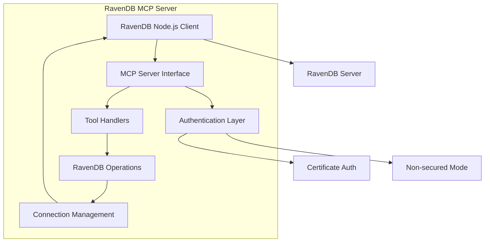
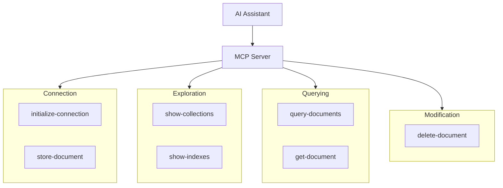

# RavenDB MCP Server - Product Requirements Document (PRD)

## 1. Project Overview

### 1.1 Purpose

To create a Model Context Protocol (MCP) server that enables AI assistants to interact with RavenDB databases through a standardized interface. This server will allow AI systems to perform common RavenDB operations including connection management, data querying, and document operations.

### 1.2 Scope

The RavenDB MCP server will provide core functionality for interacting with RavenDB 7.x databases, focusing on basic read/write operations and queries. The initial implementation will prioritize simplicity and core functionality over advanced features or performance optimizations.

### 1.3 Target Users

Companies using RavenDB in production environments who wish to enable AI assistant interaction with their databases.

## 2. Core Requirements

### 2.1 Functional Requirements

#### 2.1.1 Authentication

**Current Implementation:**

- Support certificate-based authentication (PFX or PEM)
- Support non-secured mode (no authentication)
- Authentication details provided via environment variables
- Certificate loading from file path

#### 2.1.2 Connection Management

- Persistent connection between tool calls
- Connection state maintained in server memory
- Support for connection re-initialization
- Clear error handling for connection failures

#### 2.1.3 Tool Operations

**Connection Tools**

- initialize-connection: Connect to a RavenDB server
- select-database: Switch to a specific database context

**Exploration Tools**

- show-collections: List available collections
- show-indexes: List available indexes

**Document Operations**

- get-document: Retrieve documents by ID
- store-document: Create or update documents
- delete-document: Remove documents

**Query Operations**

- query-documents: Execute RQL queries with results handling

### 2.2 Technical Requirements

#### 2.2.1 Technology Stack

- Node.js runtime
- TypeScript implementation
- RavenDB Node.js client
- MCP SDK for server implementation
- Zod for schema validation

#### 2.2.2 Error Handling

- Return meaningful RavenDB error messages
- Omit stack traces from error responses
- Categorize errors appropriately
- Provide clear error recovery instructions

#### 2.2.3 Packaging

- NPM package installable via npx
- Proper package.json configuration
- Clear installation instructions

## 3. Implementation Details

### 3.1 Server Architecture

**Core Components**

- MCP Server Interface
- Authentication Layer (API key initially)
- Tool Handlers
- RavenDB Operations
- Connection Management

**Request Flow**

```
Client Request → Validate Input → Execute Operation → Format Response → Send Response
```

### 3.2 Tool Specifications

Each tool will include:

- Name and description
- Input schema using Zod
- Validation logic
- Error handling
- Response formatting

### 3.3 Environment Configuration

**Current Implementation:**

Required environment variables:

```
# Authentication Method
RAVENDB_AUTH_METHOD=certificate  # Options: certificate, none

# Certificate Authentication
RAVENDB_CERT_PATH=/path/to/cert.pfx  # For certificate auth (PFX or PEM)
RAVENDB_CERT_PASSWORD=password  # For certificate auth (optional if not password-protected)

# Connection
RAVENDB_URL=https://server:port  # Default RavenDB server URL

# Optional settings
RAVENDB_QUERY_TIMEOUT=30000  # Query timeout in milliseconds (optional)
```

## 4. Implementation Plan

### 4.1 Phase 1: Core Infrastructure with Certificate Auth

- Server setup and configuration
- Certificate authentication implementation
- Connection management
- Basic error handling

### 4.2 Phase 2: Basic Tools

- initialize-connection (with API key auth)
- select-database
- show-collections
- get-document
- query-documents

### 4.3 Phase 3: Additional Tools

- show-indexes
- store-document
- delete-document

### 4.4 Phase 4: Packaging & Documentation

- NPM package configuration
- Usage documentation
- Example queries and operations

### 4.5 Future Phases (Post v1.0)

- Performance optimizations
- Advanced features

## 5. Future Considerations

Potential future enhancements (not in initial scope):

- Additional authentication methods
- Performance optimizations and caching
- Advanced RavenDB features (attachments, time series, etc.)
- Streaming capabilities for large result sets
- Query building helpers
- Additional administrative tools

## 6. Architecture Diagram



## 7. Tools Overview


