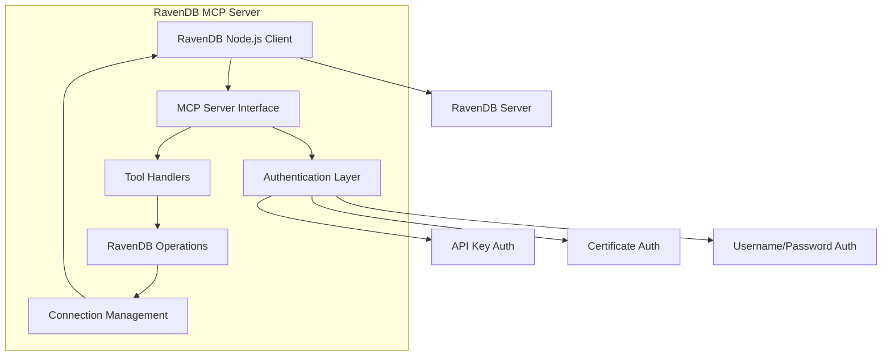
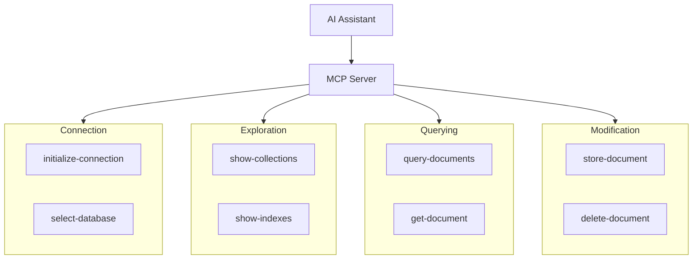

# System Patterns: RavenDB MCP Server

## System Architecture

The RavenDB MCP Server follows a layered architecture with clear separation of concerns:



## Key Components

### 1. MCP Server Interface

- Receives tool invocations from AI assistants
- Validates inputs against schemas
- Routes requests to appropriate handlers
- Formats responses for the client

### 2. Authentication Layer

- Manages multiple authentication methods
- Handles API key, certificate, and username/password auth
- Configurable via environment variables
- Secures connections to RavenDB

### 3. Tool Handlers

- Implements each tool's specific logic
- Validates input parameters
- Executes RavenDB operations
- Formats tool-specific responses

### 4. RavenDB Operations

- Encapsulates database operations
- Handles document storage and retrieval
- Executes queries
- Manages indexes and collections

### 5. Connection Management

- Maintains persistent session between calls
- Handles database selection
- Manages connection state
- Provides connection error handling

## Request Flow Pattern

Each request follows this standard flow:

```
Client Request → Validate Input → Execute Operation → Format Response → Send Response
```

## Tool Organization Pattern

Tools are organized into functional categories:



## Design Patterns

### 1. Factory Pattern

- Used for creating RavenDB client instances
- Abstracts connection details
- Supports multiple authentication methods

### 2. Singleton Pattern

- Used for connection management
- Maintains a single connection instance
- Reused across tool invocations

### 3. Repository Pattern

- Encapsulates document operations
- Provides clean abstraction for CRUD operations
- Separates business logic from data access

### 4. Adapter Pattern

- Adapts RavenDB client responses to MCP format
- Standardizes error handling
- Provides consistent response structure

## Error Handling Strategy

1. Validation errors: Caught at input schema validation
2. Connection errors: Managed by connection layer
3. RavenDB errors: Translated to meaningful messages
4. Runtime errors: Captured and formatted appropriately

## Code Organization

The codebase is organized by functional areas:

```
src/
  ├── index.ts           # Entry point
  ├── server.ts          # MCP server setup
  ├── auth/              # Authentication methods
  ├── common/            # Shared utilities
  │   ├── errors.ts      # Error handling
  │   └── utils.ts       # Common utilities
  ├── operations/        # RavenDB operations
  │   └── ravendb/
  │       ├── connection.ts  # Connection management
  │       ├── documents.ts   # Document operations
  │       ├── indexes.ts     # Index operations
  │       └── queries.ts     # Query execution
  └── types/             # TypeScript type definitions
      └── config.ts      # Configuration types
```

This structure ensures clear separation of concerns and maintainability as the codebase grows.
